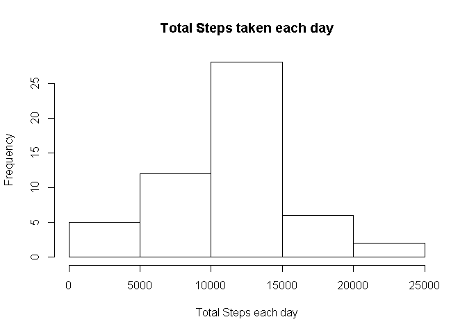
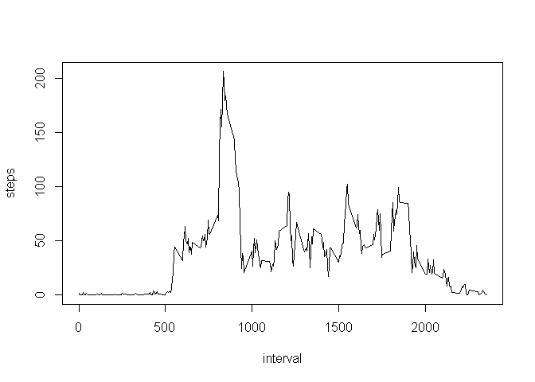
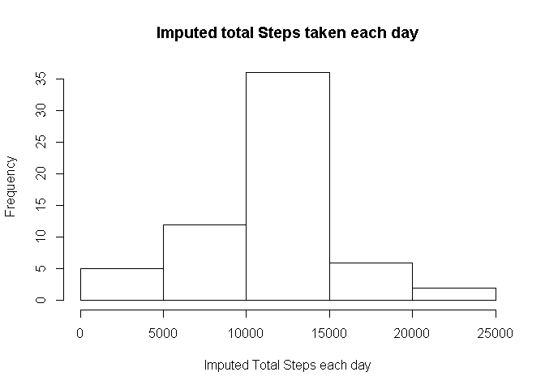
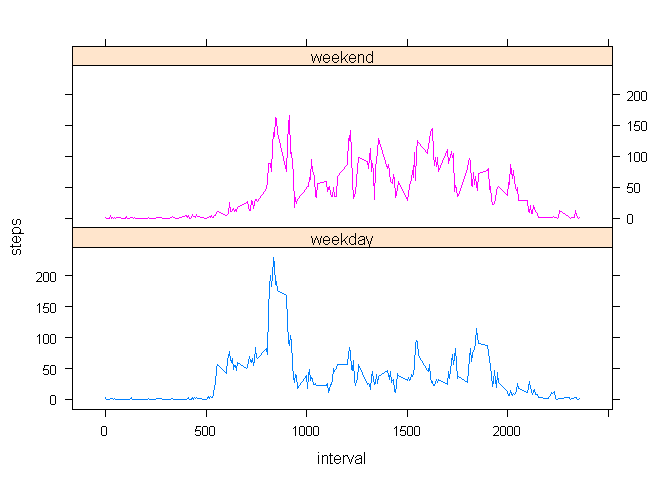

# Course Project 1 - Activity Monitoring Data
Rong Su  
Friday, November 14, 2014  

First Step is to read the zip file from the course page and then unzip and read activity.csv file into R.

```r
setwd("~/ReproducibleResearch")
fileURL <- "http://d396qusza40orc.cloudfront.net/repdata%2Fdata%2Factivity.zip"
download.file(fileURL, destfile = "./activitymonitoring.zip",method = "auto")
dateDownloaded <- date()

if(!file.exists("data")) {
    dir.create("data")
}
zipdir <- "./data"
unzip("activitymonitoring.zip",exdir=zipdir)
files <- list.files(zipdir)
if(length(files)>1) stop("More than one data file inside.")
filepath <- paste(zipdir,files[1],sep="/")
activitydata <- read.csv(filepath)
```

The second step is to aggregate the data into steps per day and make a histogram of total number of steps taken each day. Then calculate Mean and Median.

```r
stepsperday <- aggregate(steps ~ date, data=activitydata, FUN=sum, na.action = na.omit)
hist(stepsperday$steps,main="Total Steps taken each day",
       xlab="Total Steps each day")
```

 

```r
mean(stepsperday$steps)
```

```
## [1] 10766.19
```

```r
median(stepsperday$steps)
```

```
## [1] 10765
```

Reshaping the data by steps and intervals, and steps are the average across all dates.

```r
stepsperinterval<- aggregate(steps ~ interval, data=activitydata, FUN=mean, na.action = na.omit)
```
We will now plot on 5 minute interval (x-axis) and average steps taken(across all days) as y-axis. As you may notice, there is a spike on the plot.

```r
plot(stepsperinterval,type="l")
```

 

As it turns out, the following 5 minute interval is the maximum spike.

```r
stepsperinterval[which.max(stepsperinterval$steps),1]
```

```
## [1] 835
```

Now we are moving on to find out more about missing data. Total number of row with NAs in the original Activity Monitoring data are as follows.

```r
sum(!complete.cases(activitydata))
```

```
## [1] 2304
```
Now we will replace the NA value with imputed value - average steps take per interval. A new dataset with replaced values will be created here.

```r
meanstepsperinterval <- aggregate(steps ~ interval, data=activitydata, FUN=mean, na.action = na.omit)
activitynew <- activitydata
for(i in 1:dim(activitynew)[1])
  if(is.na(activitynew[i,1]) & length(meanstepsperinterval[which(meanstepsperinterval$interval==activitynew[i,3]),2])>0)
      activitynew[i,1] <- meanstepsperinterval[which(meanstepsperinterval$interval==activitynew[i,3]),2]
```
We will re-calculate the total number of steps per day, mean, and median based on the new data after replacing NAs. Then calculate Mean and Medium again. These values are slightly different from the calculation in step 1. But they are not that different.


```r
newstepsperday <- aggregate(steps ~ date, data=activitynew, FUN=sum)
hist(newstepsperday$steps,main="Imputed total Steps taken each day",
       xlab="Imputed Total Steps each day")
```

 

```r
mean(newstepsperday$steps)
```

```
## [1] 10766.19
```

```r
median(newstepsperday$steps)
```

```
## [1] 10766.19
```
Now we are adding a new factor colunm to the new dataset to identify whether it is weekday or weekend. The following is a plot showing the pattern diffference in terms of steps (average steps cross all days by weekend and weekday) and interval. As it appears, weekend activities seem to be more in steady stream while weekday activities are more concentrated at a range of intervals.

```r
activitynew$weekdays <- ifelse(weekdays(as.Date(activitynew$date)) != "Sunday" & weekdays(as.Date(activitynew$date)) != "Saturday", "weekday","weekend")
newstepsperinterval<- aggregate(steps ~ interval + weekdays, data=activitynew, FUN=mean)

library(lattice)
xyplot(steps~interval|weekdays, group=weekdays, data=newstepsperinterval,type='l', layout=c(1,2))
```

 
